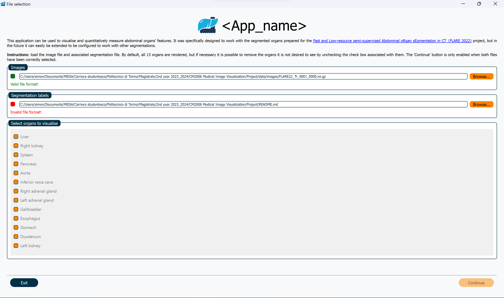
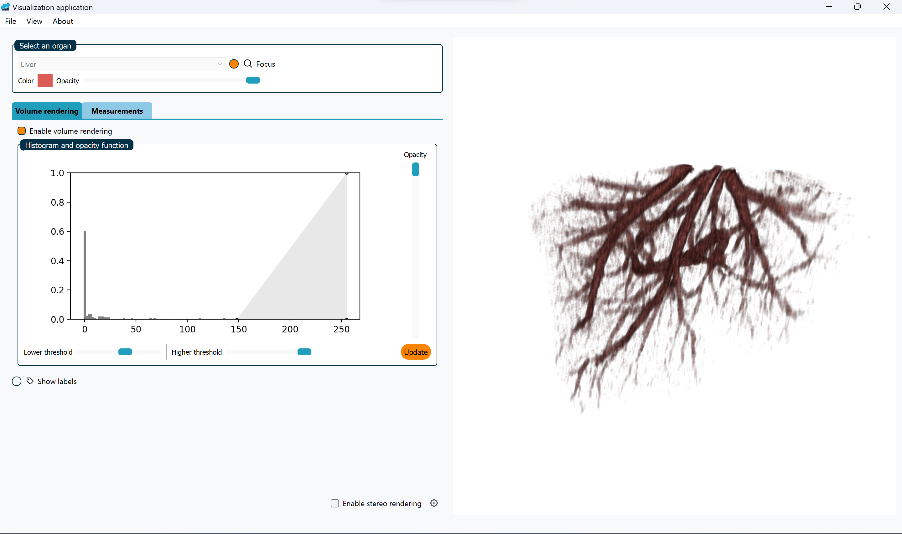
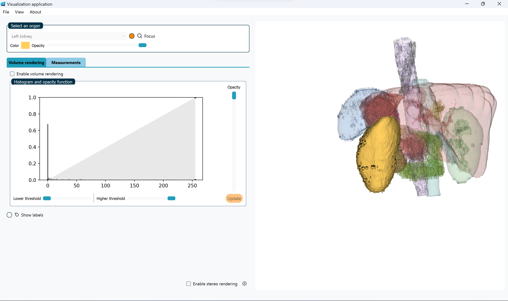
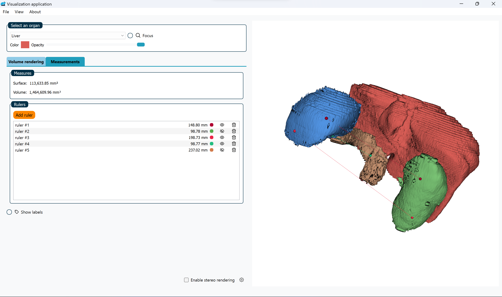
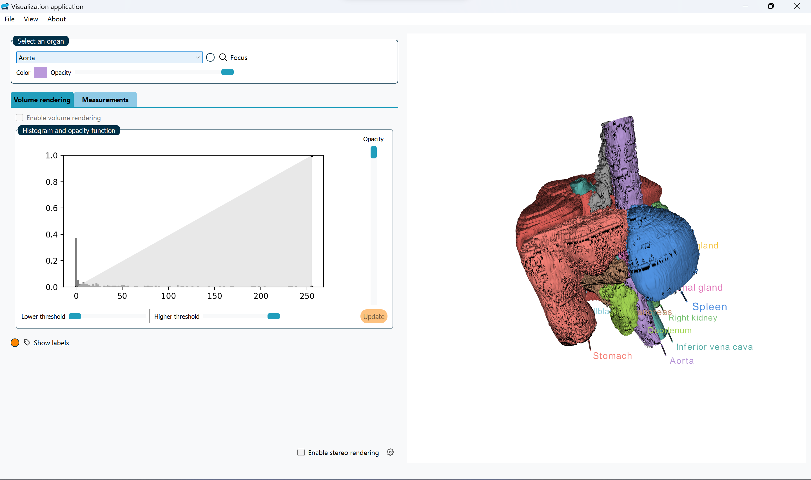

<!-- PROJECT LOGO -->
 

    

<h3 align="center">CM2006 - Group Project</h3>

<h4 align="center">Medical image visualization application</h4>

    <a href="https://github.com/electrogram-project/electrogram/issues">Report Bug</a>
    ·
    <a href="https://github.com/electrogram-project/electrogram/issues">Request Feature</a>
  

<!-- TABLE OF CONTENTS -->

  
Table of Contents

  <ol>
    <li>
      <a href="#about-the-project">About The Project</a>
      <ul>
        <li><a href="#built-with">Built With</a></li>
      </ul>
    </li>
    <li>
      <a href="#getting-started">Getting Started</a>
    </li>
    <li>
      <a href="#tools">Tools</a>
    </li>
    <li><a href="#to-dos">To-dos</a></li>
    <li>
      <a href="#screenshots">Screenshots</a>
    </li>
    <li><a href="#license">License</a></li>
    <li><a href="#acknowledgments">Acknowledgments</a></li>
</ol>

<!-- ABOUT THE PROJECT -->

## About The Project

This application was created by Fannie Martin and Simone Bonino for the CM2006 course project.

### Built With

- [🐍 Python](https://www.python.org/)
- [🎨 Qt6](https://pypi.org/project/PyQt6/)
- [🧊 VTK](https://vtk.org/)

<!-- GETTING STARTED -->

## Getting Started

Use `python run.py` to start the application.

## Tools

Use `python ui2py.py` after modifying the .ui files through "Qt Designer" to compile them in python.

Use `python make_dist.py` to make a standalone executable file. (Tested on Windows 11 Home - 22H2)

## To-dos

- [X] Add qss stylesheet
- [X] Change view animation (front/back/left/right/default in menubar)
- [X] Organs names labels
- [X] Ruler history tree
- [X] Ruler utility
- [X] Focus animation
- [X] About menu dialog
- [X] Volume histogram slider
- [X] Saved history of the previously loaded files paths.
- [X] Stereo rendering settings
- [X] Color picker
- [X] Stereo rendering
- [X] Opacity slider
- [X] Volume rendering
- [X] Surface rendering
- [x] Initial application

## Screenshots

- Welcome page

  

- Volume rendering

  

- Focus mode

  

- Measuring rulers

  

- Organ labels

  

  
<!-- LICENSE -->

## License

Distributed under the Apache License 2.0. See `LICENSE.txt` for more
information.

## Acknowledgments

The application was realised using the [FLARE 2022](https://flare22.grand-challenge.org/) dataset as a starting point.

(<a href="#readme-top">back to top</a>)
